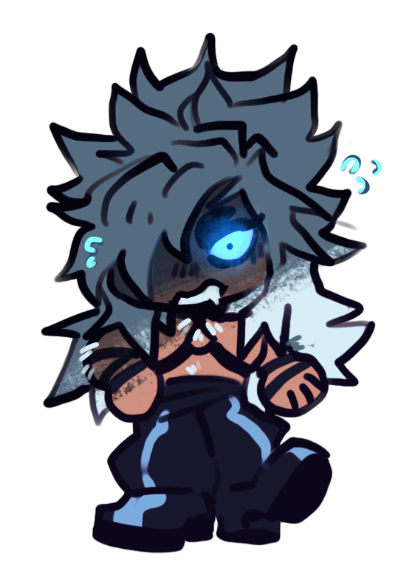
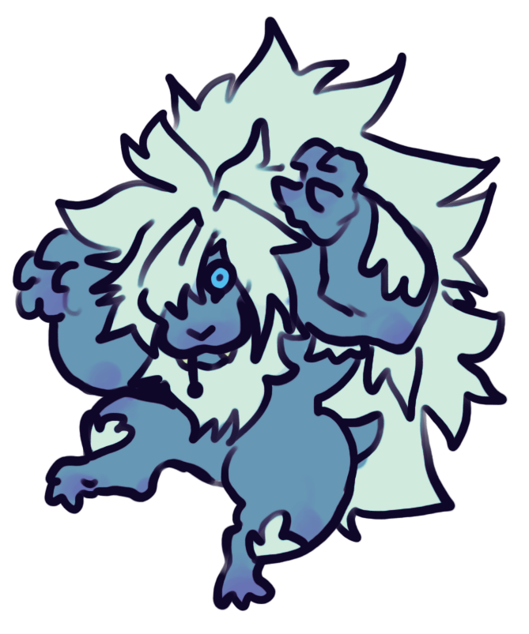

# Final-Project-The-infection
# The report

## Overview:
This final project will focus on the interaction of walkers in an environment.(will attempt 3D visuals if enough time is available). These walkers will be either a traveler, werewolf or infected one - an amount of travelers and werewolves will traverse the same terrain. These terrains will(should) hold obstacles such as infections, walls, and cliffs. Emphasis on the infections - we are studying the population of travelers(humans) of how werewolves would interact with travelers/humans. 

### Part 1:
Use the random walk's method to represent a werewolf and a traveler. The walkers are essentially a function that would allow these different characters to move along a plane.
Create a definition of a werewolf walker. which should be able to travel further in a short period of time. Behind the scenes, if a ‘traveler’ is within a certain radius, that traveler would turn into a werewolf. Create a definition for a traveler. The traveler should be able to turn into a werewolf if it's within a certain radius of the werewolf. Create a definition for an infected traveler. The infected traveler would then act as a werewolf.Use a variety of functions to create terrains - start with a flat terrain for part 1, and evolve the terrains in part 2.

Make a number(n) of travelers and werewolves spawn. To then be able to produce the probability of turning into a werewolf.

Produce a summary of the initial results and the ending of the simulation results. The summary should include # of travelers and werewolves at initial and final  after a number of iterations have occurred. Probability of being infected by a werewolf in a terrain.

What would be produced?
Output summary would include initial travelers and werewolves, final travelers and werewolves, number of iterations that have occurred, probability of turning into a werewolf in mention type of terrain
Heatmap with trails with a legend

### Part 1 results:

Part one was in charge of creating the data and mostly analyzing terminal outputs. I wanted to focus more on the numbers and functionality of the program before visually plotting them. Currently, the way these results are expected to output is that user inputs are all on a python file called, Simulation_part1. Which holds a variety of user inputs, such as picking the type of terrain(by defaults its a flat terrain), Number of travelers and werewolves that are placed, Amount of steps that can be taken by each function, the step size, infection radius and the terrain size. In thought, the probability of depends greatly on all these factors..There is so much variety to explore.

Outputs also explore starting points and ending points, this helped me make sure that they were actually moving and eventually i'll need to extract each and every point to save in an empty array in order to plot their paths which would be visuals focused on part 2.

### Part 2:
Add - plotting 
Make a definition for terrain obstacles. These would be randomly generated and occur randomly. Such as - being able to run off cliffs, getting stuck in dips. This would most-likely just be a modified version of the random walk function.
Travelers have become smarter; they will now prefer to climb up terrain and mountains. Werewolves will prefer lower terrain(?).
If a traveler is bit by a werewolf, travelers nearby 

Observe how these complex terrains affect these numbers, use part one’s flat terrain, and compare with different function terrains

What would be produced?
Output summary(initial travelers and werewolves, final travelers and werewolves, number of iterations, n,  probability of turning into a werewolf in [mention type of terrain])
Heatmap with trails with a legend for a flat area
Heatmap with trails with a legend for a more complex function(not flat)

### Part 2 results:

### Part 3:

# Autopsy of the Lycanthrope Virus
This is the overview and study of the way a certain wolf virus is to be carried and spread across a desired plain.

